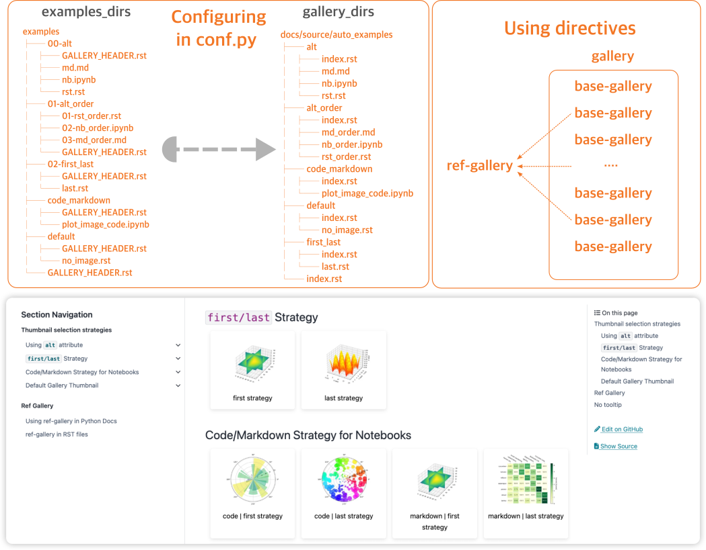

<h1 align="center">

</h1><br>

[](https://pypi.org/project/myst-sphinx-gallery/)
[](https://myst-sphinx-gallery.readthedocs.io/en/latest/?badge=latest)
[](https://codecov.io/gh/Fanchengyan/myst-sphinx-gallery)

## Introduction

**MyST Sphinx Gallery** is a Sphinx extension that allows you to build galleries of examples from Jupyter Notebooks (`.ipynb`), Markdown (`.md`) or reStructuredText (`.rst`) files.  It works with `MyST` Ecosystem, including [MyST-parser](https://myst-parser.readthedocs.io/en/latest/) and [MyST-NB](https://myst-nb.readthedocs.io/en/latest/), to render markdown or jupyter notebooks in Sphinx documentation.



## Highlight Features

- **Convenient to use** - You can easily generate a gallery of examples from
your Jupyter Notebooks, Markdown, or reStructuredText files. It works with `MyST` Ecosystem, including [MyST-parser](https://myst-parser.readthedocs.io/en/latest/) and [MyST-NB](https://myst-nb.readthedocs.io/en/latest/), to render markdown or jupyter notebooks in Sphinx documentation.
- **Fast and robust** - It utilizes existing images to generate gallery thumbnails, eliminating code execution delays and potential accidental errors when building gallery.
- **Customizable** - You can customize the gallery, such as thumbnail selection, layout, and styling.

## Documentation

The detailed documentation is available at: [https://myst-sphinx-gallery.readthedocs.io/en/latest/](https://myst-sphinx-gallery.readthedocs.io/en/latest/)

## Quick Start

> [!NOTE]
> The quick start guide here is a brief introduction to the MyST Sphinx Gallery extension. More detailed Quick Start guide is available at: [Quick Start](https://myst-sphinx-gallery.readthedocs.io/en/latest/user_guide/quick_start.html).


## Installation

**MyST Sphinx Gallery** is a Python package, and requires `Python >= 3.8`. You can install the latest release using `pip` from the PyPI:

```bash
pip install myst_sphinx_gallery
```

## Configure and usages

To use MyST Sphinx Gallery, you need to add the following code to the Sphinx `conf.py` file:

```python
from pathlib import Path
from myst_sphinx_gallery import GalleryConfig, generate_gallery

generate_gallery(
    GalleryConfig(
        examples_dirs="../../examples",
        gallery_dirs="auto_examples",
        root_dir=Path(__file__).parent,
        notebook_thumbnail_strategy="code",
    )
)
```

>[!NOTE]
> You can generate **multiple galleries** by proper configuration in the `conf.py` file. For more details, please refer to the [Configure multiple galleries](https://myst-sphinx-gallery.readthedocs.io/en/latest/user_guide/multi_galleries.html#configure-multiple-galleries).

## Construct the examples folder

To generate the gallery, you need to create a well-structured examples folder. The detailed documentation of structuring files for gallery is available at: [Structuring files for Gallery](https://myst-sphinx-gallery.readthedocs.io/en/latest/user_guide/example_structure.html) and [Controlling Examples Order
](https://myst-sphinx-gallery.readthedocs.io/en/latest/user_guide/order.html).


## Select the thumbnail for an example file

- **one image** - If there only one image in an example file, no additional configuration is needed, and that image will be used as the gallery thumbnail.
- **multiple images** - If there are multiple figures in an example file, you can specify the strategy to determine which thumbnail will be used for the gallery. The following strategies are supported:
  1. **alt** - If the alt attribute of an image/figure is set to gallery_thumbnail, that image/figure will be used as the gallery thumbnail for this file.
  2. **first/last** - If there are multiple images that can be used as the gallery thumbnail, the first/last image will be selected. You can specify the strategy by setting the thumbnail_strategy in the configuration file. The default value is first.
  3. **code/markdown** - For Jupyter notebook files, both markdown and code cells can contain images. You can specify the strategy by setting the notebook_thumbnail_strategy in the configuration file. The default value is code.
- **no image** - If no image/figure is found, the default thumbnail will be used.


More details can be found in the [Thumbnail Strategies](https://myst-sphinx-gallery.readthedocs.io/en/latest/user_guide/thumb.html).

## Customize the layout and thumbnail


You can customize the layout and thumbnail behaviors for the gallery using the MyST Sphinx Gallery extension. For more details, please refer to the section [Configuration for Generating Galleries
](https://myst-sphinx-gallery.readthedocs.io/en/latest/user_guide/custom.html).

> [!TIP]
> The [Examples-3 : Costumizing Grid and Thumbnail](https://myst-sphinx-gallery.readthedocs.io/en/latest/auto_examples3/index.html) is an example gallery used to demonstrate the customization of the layout and thumbnail, providing an intuitive understanding of customizing behaviors.
